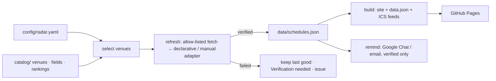

# PaperRadar

**A deadline radar for the conferences, journals and workshops of *your* research field.**
Fork it, list your fields in one config file, and get a static site with
D-days, subscribable calendars and Google Chat / email reminders — refreshed
every day from the official CFPs by GitHub Actions. No server, no database.

[한국어 → README.md](README.md)

- **Config-driven.** `config/radar.yaml` picks fields, venues, rankings,
  timezone, languages and reminder thresholds. Everything else is shared.
- **Catalog, not scraping heuristics.** `catalog/` holds one file per venue
  with a declarative adapter for its CFP page. Add your field's venues once;
  everyone benefits.
- **Verified or nothing.** Dates are read only from registered official pages.
  A failed check keeps the last good value and flags it; nothing is guessed.
  See [docs/trust-policy.md](docs/trust-policy.md).
- **Calendars that update in place.** RFC 5545 feeds for everything, per type,
  per ranking tier and per venue, with `SEQUENCE`/`CANCELLED` handling.
- **Reminders where you already are.** Google Chat webhook (a one-person space
  works as a personal channel) and/or SMTP email, 60/30/15/3 days before.
- **Bilingual UI** (Korean / English), official time + your timezone, dark mode,
  keyboard accessible, and a built-in *Setup guide* tab.

## Quick start

```bash
git clone https://github.com/<you>/PaperRadar.git
cd PaperRadar
npm ci
cp config/radar.example.yaml config/radar.yaml   # then edit it
npm run doctor        # explains what is configured and what is missing
npm run refresh       # reads every tracked CFP → data/schedules.json
npm run build         # → dist/ (site, data.json, calendars/*.ics)
npm run dev           # http://127.0.0.1:4173
```

Requires Node.js 22+.

### Point it at your field

```yaml
# config/radar.yaml
select:
  fields: [systems, cloud, sustainable-computing]   # ids in catalog/fields.json
  venues: [neurips, tpds]                           # ids in catalog/venues/
  types: [conference, journal, workshop]
rankings:
  show: [kiise-2024, core-2026, sjr-2025]
  primary: kiise-2024
site:
  timezone: Asia/Seoul
  languages: [ko, en]
  baseUrl: https://<you>.github.io/PaperRadar/
reminders:
  daysBefore: [60, 30, 15, 3]
  channels: [google-chat]
```

Venues missing from the catalog? `npm run new-venue` scaffolds a file and
`npm run probe` helps you write the pattern —
[docs/adding-a-venue.md](docs/adding-a-venue.md). Pages that cannot be
parsed take a `manual` adapter with the date you checked them.

### Deploy

1. Repository *Settings → Pages → Source: GitHub Actions*.
2. Push to `main`. The *Deploy Pages* workflow builds and publishes `dist/`.
3. *Settings → Secrets → Actions*: add `GOOGLE_CHAT_WEBHOOK_URL`
   ([how](docs/setup-google-chat.md)) and/or the SMTP secrets.
4. *Actions → Daily refresh → Run workflow* with **test_notification** ticked
   to confirm the channel works.

From then on `refresh.yml` runs daily (02:17 KST by default): refresh → test
→ validate → build → reminders → commit `data/` → deploy. A source that fails
verification opens (or updates) one issue labelled `source-failure`; the site
keeps the last verified dates.

## How it works



| Path | What lives there |
|---|---|
| `config/radar.yaml` | Your choices (the only file you edit) |
| `catalog/fields.json` | Field taxonomy |
| `catalog/rankings/*.json` | Ranking schemes keyed by venue id (KIISE 2024, CORE 2026, SJR quartiles, …) |
| `catalog/venues/*.json` | One venue per file: identity + CFP adapter |
| `data/schedules.json` | Collected deadlines with status and provenance |
| `data/updates.json` | Change log (added / changed / removed / failed / recovered) |
| `data/state/` | Calendar sequence numbers, sent reminders |
| `site/` | Static front-end |
| `scripts/` | `doctor`, `validate`, `refresh`, `build`, `remind`, `probe`, `new-venue`, `serve` |

Full option list: [docs/config-reference.md](docs/config-reference.md).

## Commands

| Command | Purpose |
|---|---|
| `npm run doctor` | Health check with plain-language guidance |
| `npm run validate` | Config + catalog + data validation (CI gate) |
| `npm run refresh` | Update `data/` from official CFPs (`--only`, `--dry-run`, `--report`) |
| `npm run build` / `npm run dev` | Build / serve `dist/` |
| `npm run remind` | Send due reminders (`--test`, `--dry-run`, `--channel`) |
| `npm run probe` | Inspect a CFP page or run one venue's adapter |
| `npm run new-venue` | Scaffold a catalog entry |
| `npm test` | Unit tests (Node test runner) |

## Catalog coverage

The seed catalog covers systems, architecture, HPC, cloud, networking,
performance, sustainable/carbon-aware computing, ML/ML-systems and energy
journals — the fields the original author works in. Rankings: KIISE 2024
(Korean BK21 reference), CORE 2026, SJR quartiles. Contributions for other
fields are very welcome — see [CONTRIBUTING.md](CONTRIBUTING.md).

## License

MIT
