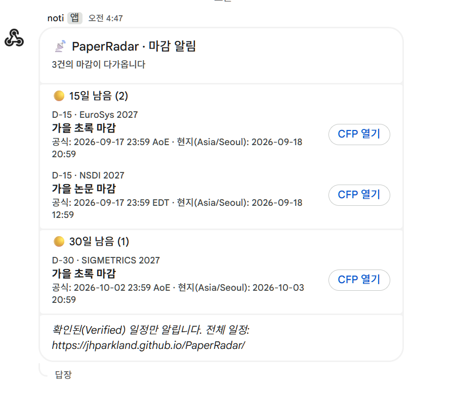
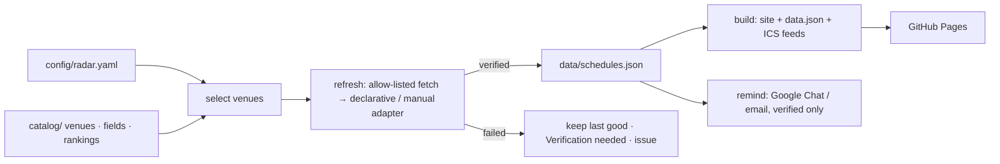

# PaperRadar

**A deadline radar for the conferences, journals and workshops of *your* research field.**
Fork it, list your fields in one config file, and get a static site with
D-days, subscribable calendars and Google Chat / email reminders — refreshed
every day from the official CFPs by GitHub Actions. No server, no database.

### 🔗 <https://jhparkland.github.io/PaperRadar/>

The example site this repository publishes. A fork of it lives at
`https://<your account>.github.io/PaperRadar/`.

[한국어 → README.md](README.md)

[](https://jhparkland.github.io/PaperRadar/)

<sub>Upcoming — D-day, official time and yours, verification status, CFP link</sub>

You never have to open it: [one digest a day](#what-gets-sent-and-when) arrives in Google Chat.

- **Config-driven.** `config/radar.yaml` picks fields, venues, rankings,
  timezone, languages and reminder thresholds. Everything else is shared.
- **Catalog, not scraping heuristics.** `catalog/` holds one file per venue
  with a declarative adapter for its CFP page. Add your field's venues once;
  everyone benefits.
- **Verified or nothing.** Dates are read only from registered official pages.
  A failed check keeps the last good value and flags it; nothing is guessed.
  See [docs/trust-policy.md](docs/trust-policy.md).
- **Calendars that update in place.** RFC 5545 feeds for everything, per type,
  per ranking tier and per venue, with `SEQUENCE`/`CANCELLED` handling.
- **Reminders where you already are.** Google Chat webhook (a one-person space
  works as a personal channel) and/or SMTP email — one digest a day, grouped
  into newly announced / due today / closing soon / 15 / 30 days.
- **Bilingual UI** (Korean / English), official time + your timezone, dark mode,
  keyboard accessible, and a built-in *Setup guide* tab.

## Quick start

```bash
git clone https://github.com/<you>/PaperRadar.git
cd PaperRadar
npm ci
cp config/radar.example.yaml config/radar.yaml   # then edit it
npm run doctor        # explains what is configured and what is missing
npm run refresh       # reads every tracked CFP → data/schedules.json
npm run build         # → dist/ (site, data.json, calendars/*.ics)
npm run dev           # http://127.0.0.1:4173
```

Requires Node.js 22+.

### Point it at your field

```yaml
# config/radar.yaml
select:
  fields: [systems, cloud, sustainable-computing]   # ids in catalog/fields.json
  venues: [neurips, tpds]                           # ids in catalog/venues/
  types: [conference, journal, workshop]
rankings:
  show: [kiise-2024, core-2026, sjr-2025]
  primary: kiise-2024
site:
  timezone: Asia/Seoul
  languages: [ko, en]
  baseUrl: https://<you>.github.io/PaperRadar/
reminders:
  daysBefore: [30, 15, 3, 0]
  channels: [google-chat]
```

[](https://jhparkland.github.io/PaperRadar/#venues)

<sub>All venues — filter by type, field and tier; untracked venues say why they are untracked</sub>

### The catalog is an example — fill it with your own field

The 71 venues in `catalog/` are **a worked example from the author's field**
(systems, cloud, carbon-aware computing). It is not a universal list and it is
not meant to be used as-is. After forking, **replace it with the venues of your
field.** Keep the structure (schema and adapter mechanics); delete what you do
not need, or drop it from `select`.

The fastest way is to **hand the job to a coding agent** (Claude Code, Codex,
Cursor, …): one venue is one documented JSON file, and [AGENTS.md](AGENTS.md)
at the repo root spells out the rules. Open the repository and ask:

```text
My research field is <field>. The entries in catalog/venues/ are an example
from a different field — replace them with mine.
- Research the conferences, journals and workshops I should submit to, add
  them under catalog/venues/, and delete the files unrelated to my field.
  Update catalog/fields.json to match.
- For each venue find the official CFP page, write a declarative adapter and
  show me the real extraction via `npm run probe -- --venue <id>`.
- If a page cannot be parsed, use the manual adapter with today's verifiedAt.
- Never invent dates or ranking tiers; leave out anything without a source URL.
- If my field has a ranking scheme, add it under catalog/rankings/ with its
  source URL.
- Finish by updating select in config/radar.yaml and getting npm run validate
  and npm test to pass.
```

When it is done, two human checks remain:

1. do the dates in `npm run probe -- --venue <id>` match the official page?
2. does `npm run doctor` list what you expect?

LLMs produce plausible dates easily. PaperRadar's validation (schema, year
plausibility, milestone order, mandatory `verifiedAt`) catches a lot, but the
**final comparison against the official page is yours**. To do it by hand:
`npm run new-venue` + `npm run probe` →
[docs/adding-a-venue.md](docs/adding-a-venue.md).

### What every fork must change

**Secrets and variables do not travel with a fork.** Notifications only work
once you connect your own channel.

| Setting | Where | Why |
|---|---|---|
| `site.baseUrl` | `config/radar.yaml` | your own Pages URL — otherwise your reminders link readers to the original author's site (`npm run doctor` flags this) |
| `site.title` · `tagline` · `timezone` · `languages` | `config/radar.yaml` | yours |
| `select.fields` · `select.venues` | `config/radar.yaml` | your field |
| `reminders.language` · `daysBefore` | `config/radar.yaml` | your preference |
| `GOOGLE_CHAT_WEBHOOK_URL` or the SMTP secrets | GitHub *Settings → Secrets and variables → Actions* | **personal channel**, never copied into a fork |

- **A webhook URL is a password.** Anyone holding it can post into your space.
  Never commit it or paste it into an issue or PR — keep it in a secret.
- For local runs put it in `.env` (git-ignored): `cp .env.example .env`
- **Everything else works without notifications** — the site, the calendar
  feeds and the daily refresh need no secrets at all. Only the messages stay
  silent.

### Deploy

1. Repository *Settings → Pages → Source: GitHub Actions*.
2. Push to `main`. The *Deploy Pages* workflow builds and publishes `dist/`.
3. *Settings → Secrets → Actions*: add `GOOGLE_CHAT_WEBHOOK_URL`
   ([how](docs/setup-google-chat.md)) and/or the SMTP secrets. To keep your own
   secret name, leave it and set the repository **variable**
   `GOOGLE_CHAT_SECRET_NAME` to that name (e.g. `NOTI`).
4. *Actions → Daily refresh → Run workflow* with **test_notification** ticked
   to confirm the channel works.

From then on `refresh.yml` runs daily (02:17 KST by default): refresh → test
→ validate → build → reminders → commit `data/` → deploy. A source that fails
verification opens (or updates) one issue labelled `source-failure`; the site
keeps the last verified dates.

## What gets sent, and when

| What | When | Where |
|---|---|---|
| **Deadline digest** | once a day, grouped into the categories below | Google Chat space / email |
| **Source verification failures** | a page could not be read or its wording changed | one GitHub issue (accumulates, auto-closes on recovery) |
| **Full change log** | every daily refresh | *Sources & updates* tab, `data/updates.json` |



<sub>A message as actually delivered: grouped by category, each line carrying the official time, the local conversion and a CFP button. (Korean UI — the digest follows `reminders.language`.)</sub>

### Categories

| Section | Meaning |
|---|---|
| 🆕 Newly announced | a TBA date was announced, or a new milestone appeared |
| 🔴 Due today | the deadline is today (`0` in `daysBefore`) |
| 🟠 Closing soon | at or below `imminentDays` (default 3) |
| 🟡 N days left | one section per remaining threshold in `daysBefore` (default 15, 30) |
| 📅 Now tracking the next edition | the tracked edition ended and the next year's CFP was adopted |
| 🔁 Date changed · ❌ Removed · ✅ Verified again | detected by the refresh (`notifyChanges`, on by default) |

```text
📡 PaperRadar · Deadline reminder
5 deadline(s) approaching

🆕 Newly announced (1)
  HotOS 2027 · Paper deadline
    2027-01-15 23:59 AoE

🔴 Due today (1)
  D-Day · ASPLOS 2027 · September cycle Paper deadline
    Official: 2026-09-09 23:59 AoE
    Local (Europe/Berlin): 2026-09-10 13:59

🟠 Closing soon (1)
🟡 15 days left (1)
🟡 30 days left (1)

Only verified deadlines are sent. Full schedule: https://<you>.github.io/PaperRadar/
```

### Rules

- Everything due that day goes out as **one message**; deadlines and schedule
  changes are not sent separately.
- A deadline introduced under "newly announced" is not repeated in another
  section of the same message.
- Only author-actionable milestones: abstract, paper, camera-ready.
  Notification and event dates go to the calendars but never to reminders.
- Each threshold fires once per deadline. What was sent is recorded in
  `data/state/reminders.json`, so re-runs never repeat. If Actions skips a day
  the reminder goes out the next day.
- A deadline that appears 10 days out is listed **once**, under the 15-day
  section — not under 30 and 15 at the same time.
- Deadlines whose page states no timezone (`unspecified`) are shown on the
  site but never pushed — we do not wake people on an assumption.
- The very first run records a starting point and announces nothing, so a fresh
  deployment does not report the 120 deadlines it just imported.
- Source failures already open a GitHub issue, so they are excluded by default;
  `reminders.notifyFailures: true` includes them.

To preview the formatting at any time:

```bash
npm run remind -- --sample 5
```

On GitHub: *Actions → Daily refresh → Run workflow → **sample_notification***.
It never touches the sent-state.

Nothing arriving? Check, in order: ① the `GOOGLE_CHAT_WEBHOOK_URL` secret (or
the `GOOGLE_CHAT_SECRET_NAME` variable) exists ② `reminders.channels` in
`radar.yaml` contains `google-chat` ③ the *Send due reminders* step log says
`nothing to send today`. Details in
[docs/setup-google-chat.md](docs/setup-google-chat.md).

## Calendar feeds

[](https://jhparkland.github.io/PaperRadar/#calendars)

Paste a feed URL into any calendar app: everything, per type, per ranking tier
or per venue. Feeds refresh twice a day; a changed date bumps `SEQUENCE` so the
existing entry is edited in place, and a removed one arrives as `CANCELLED`.

## When the year rolls over

A venue file tracks one edition. Once its deadlines have all passed,
PaperRadar **finds the next year's CFP by itself** — for venues that publish
each edition at a URL differing only by the year:

```json
"rollover": {
  "url": "https://{year}.eurosys.org/cfp.html",
  "allowedHosts": ["{year}.eurosys.org"],
  "maxAhead": 2
}
```

**20 of the 26** CFP-tracked venues in the catalog carry this block. On
adoption the venue file's `url` and `edition` are rewritten and committed, so
the move shows up as a git diff; the old edition stays in
`data/schedules.json` as history and the digest reports **📅 Now tracking the
next edition**.

Adoption is deliberately hard to earn: the page must parse with this venue's
own patterns, carry at least one **future** author deadline, and not consist
entirely of dates older than the current edition — that last rule is what
rejects a next-year page still showing last year's CFP (SIGCOMM 2027 is
rejected by it today). A probe that fails is silent and retried tomorrow.

Venues that move host between editions (`hpdc.sci.utah.edu/2026/` → somewhere
else) cannot be followed automatically. A human updates the file, and once the
old page disappears the `source-failure` issue says so. See
[docs/adding-a-venue.md](docs/adding-a-venue.md).

## How it works



| Path | What lives there |
|---|---|
| `config/radar.yaml` | Your choices (the only file you edit) |
| `catalog/fields.json` | Field taxonomy |
| `catalog/rankings/*.json` | Ranking schemes keyed by venue id (KIISE 2024, CORE 2026, SJR quartiles, …) |
| `catalog/venues/*.json` | One venue per file: identity + CFP adapter |
| `data/schedules.json` | Collected deadlines with status and provenance |
| `data/updates.json` | Change log (added / changed / removed / failed / recovered) |
| `data/state/` | Calendar sequence numbers, sent reminders |
| `site/` | Static front-end |
| `scripts/` | `doctor`, `validate`, `refresh`, `build`, `remind`, `probe`, `new-venue`, `serve` |

Full option list: [docs/config-reference.md](docs/config-reference.md).

## Commands

| Command | Purpose |
|---|---|
| `npm run doctor` | Health check with plain-language guidance |
| `npm run validate` | Config + catalog + data validation (CI gate) |
| `npm run refresh` | Update `data/` from official CFPs (`--only`, `--dry-run`, `--report`) |
| `npm run build` / `npm run dev` | Build / serve `dist/` |
| `npm run remind` | Send the daily digest (`--test`, `--sample [n]`, `--dry-run`, `--channel`) |
| `npm run probe` | Inspect a CFP page or run one venue's adapter |
| `npm run new-venue` | Scaffold a catalog entry |
| `npm test` | Unit tests (Node test runner) |

## Catalog coverage

The seed catalog covers systems, architecture, HPC, cloud, networking,
performance, sustainable/carbon-aware computing, ML/ML-systems and energy
journals — the fields the original author works in. Rankings: KIISE 2024
(Korean BK21 reference), CORE 2026, SJR quartiles.

## Contributing

This repository is meant to be a **shared, growing catalog**, not one
person's tool.

| Situation | Do this |
|---|---|
| A date is wrong, the site broke, a command fails | [Open an issue](../../issues) with the venue, the official page URL and the command to reproduce |
| You added venues for your field / fixed an adapter | **Pull request** — usually just `catalog/venues/<id>.json` (+ `rankings/` if applicable) |
| You want another ranking scheme (CCF, a field-specific list, …) | PR adding `catalog/rankings/<scheme>.json` with a source URL |
| Code bugs, improvements | PR — behaviour changes come with a test under `test/` |

CI runs `npm test → validate → build` on every PR and catches schema errors,
broken regexes and malformed dates. Rules and the checklist (official sources
only, never invent, `verifiedAt`) are in [CONTRIBUTING.md](CONTRIBUTING.md).
If an LLM wrote the catalog files, say so in the PR and paste the `probe`
output — it makes review much faster.

## License

MIT
