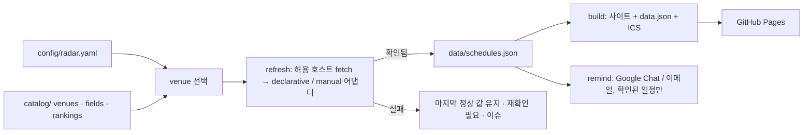

# PaperRadar

**내 연구 분야의 학술대회·저널·워크숍 마감을 한곳에서 보는 레이더.**
포크해서 설정 파일 하나에 분야를 적으면, D-day가 붙은 정적 사이트, 구독 가능한
캘린더, Google Chat / 이메일 리마인더가 생깁니다. GitHub Actions가 매일 공식
CFP를 다시 읽어 갱신하고 GitHub Pages에 배포합니다. 서버도 DB도 없습니다.

[English → README.en.md](README.en.md)

- **설정 파일 하나.** `config/radar.yaml`에서 분야·venue·등급 체계·시간대·언어·알림
  시점을 고릅니다. 나머지는 모두 공유 자산입니다.
- **카탈로그 방식.** `catalog/`에 venue마다 파일 하나와 그 CFP 페이지를 읽는
  선언형 어댑터가 있습니다. 내 분야 학회를 한 번 넣으면 모두가 씁니다.
- **확인된 일정만.** 등록된 공식 페이지에서만 날짜를 읽습니다. 확인에 실패하면
  마지막 정상 값을 유지하고 표시할 뿐, 추정하지 않습니다.
  → [docs/trust-policy.md](docs/trust-policy.md)
- **제자리에서 갱신되는 캘린더.** 전체·유형별·등급별·venue별 RFC 5545 피드.
  변경 시 `SEQUENCE` 증가, 삭제 시 `CANCELLED`.
- **쓰던 곳으로 오는 알림.** Google Chat 웹훅(혼자 있는 스페이스 = 개인 알림)
  그리고/또는 SMTP 이메일. 60/30/15/3일 전.
- **한국어/영어 UI**, 공식 시각 + 내 시간대, 다크 모드, 키보드 접근성,
  사이트 안에 **설정 가이드 탭** 내장.

## 빠른 시작

```bash
git clone https://github.com/<you>/PaperRadar.git
cd PaperRadar
npm ci
cp config/radar.example.yaml config/radar.yaml   # 편집
npm run doctor        # 설정 상태와 빠진 것을 설명
npm run refresh       # 추적 대상 CFP를 모두 읽어 data/schedules.json 갱신
npm run build         # → dist/ (사이트, data.json, calendars/*.ics)
npm run dev           # http://127.0.0.1:4173
```

Node.js 22 이상이 필요합니다.

### 내 분야로 맞추기

```yaml
# config/radar.yaml
select:
  fields: [systems, cloud, sustainable-computing]   # catalog/fields.json 의 id
  venues: [neurips, tpds]                           # catalog/venues/ 의 id
  types: [conference, journal, workshop]
rankings:
  show: [kiise-2024, core-2026, sjr-2025]
  primary: kiise-2024
site:
  timezone: Asia/Seoul
  languages: [ko, en]
  baseUrl: https://<you>.github.io/PaperRadar/
reminders:
  daysBefore: [60, 30, 15, 3]
  channels: [google-chat]
```

카탈로그에 없는 학회는 `npm run new-venue`로 파일을 만들고 `npm run probe`로
CFP 페이지의 날짜 위치를 확인해 패턴을 채웁니다 →
[docs/adding-a-venue.md](docs/adding-a-venue.md). 자동 파싱이 안 되는 페이지는
`manual` 어댑터에 날짜와 확인일을 직접 적습니다.

### 배포

1. 저장소 *Settings → Pages → Source: GitHub Actions*.
2. `main`에 push. *Deploy Pages* 워크플로가 `dist/`를 빌드해 배포합니다.
3. *Settings → Secrets → Actions*에 `GOOGLE_CHAT_WEBHOOK_URL`
   ([설정 방법](docs/setup-google-chat.md)) 그리고/또는 SMTP 시크릿 추가.
4. *Actions → Daily refresh → Run workflow*에서 **test_notification**을 체크해
   채널이 동작하는지 확인.

이후 `refresh.yml`이 매일(기본 02:17 KST) 실행됩니다: 갱신 → 테스트 → 검증 →
빌드 → 알림 → `data/` 커밋 → 배포. 출처 확인에 실패한 venue는
`source-failure` 라벨 이슈 하나에 누적되고, 사이트는 마지막 확인 값을 유지합니다.

## 동작 구조



| 경로 | 내용 |
|---|---|
| `config/radar.yaml` | 내 선택 (편집하는 유일한 파일) |
| `catalog/fields.json` | 분야 분류 |
| `catalog/rankings/*.json` | venue id 기준 등급 체계 (KIISE 2024, CORE 2026, SJR 분위 …) |
| `catalog/venues/*.json` | venue 파일: 정체성 + CFP 어댑터 |
| `data/schedules.json` | 수집된 마감 + 상태 + 출처 |
| `data/updates.json` | 변경 로그 |
| `data/state/` | 캘린더 SEQUENCE, 발송된 알림 |
| `site/` | 정적 프런트엔드 |
| `scripts/` | `doctor`, `validate`, `refresh`, `build`, `remind`, `probe`, `new-venue`, `serve` |

전체 옵션: [docs/config-reference.md](docs/config-reference.md).

## 명령어

| 명령어 | 역할 |
|---|---|
| `npm run doctor` | 설정 점검과 안내 |
| `npm run validate` | 설정·카탈로그·데이터 검증 (CI 게이트) |
| `npm run refresh` | 공식 CFP에서 `data/` 갱신 (`--only`, `--dry-run`, `--report`) |
| `npm run build` / `npm run dev` | `dist/` 빌드 / 로컬 제공 |
| `npm run remind` | 알림 발송 (`--test`, `--dry-run`, `--channel`) |
| `npm run probe` | CFP 페이지 분석, venue 어댑터 실행 |
| `npm run new-venue` | 카탈로그 파일 스캐폴드 |
| `npm test` | 단위 테스트 |

## 카탈로그 범위

초기 카탈로그는 시스템·구조·HPC·클라우드·네트워킹·성능·지속가능(탄소 인식)
컴퓨팅·ML/ML 시스템·에너지 저널을 다룹니다. 등급: KIISE 2024(BK21 참고),
CORE 2026, SJR 분위. 다른 분야 기여를 환영합니다 →
[CONTRIBUTING.md](CONTRIBUTING.md).

## 라이선스

MIT
