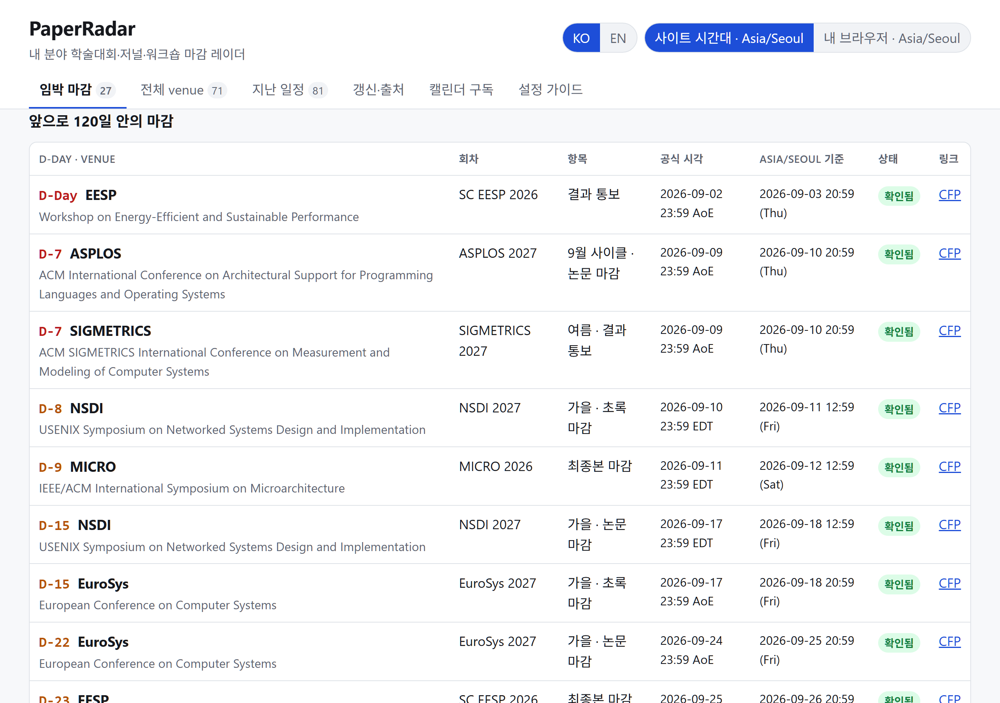
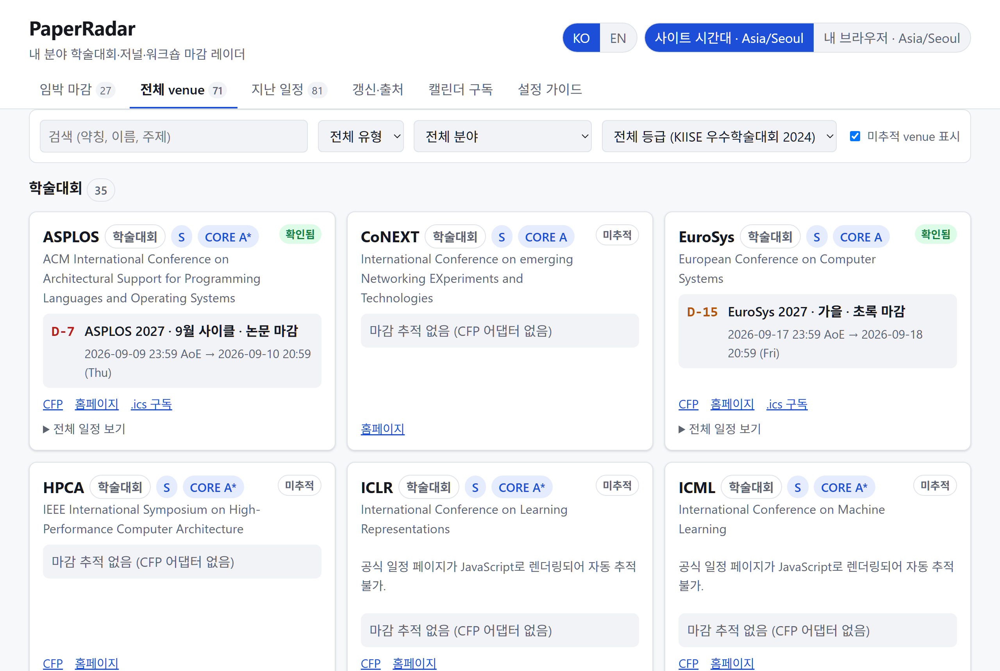
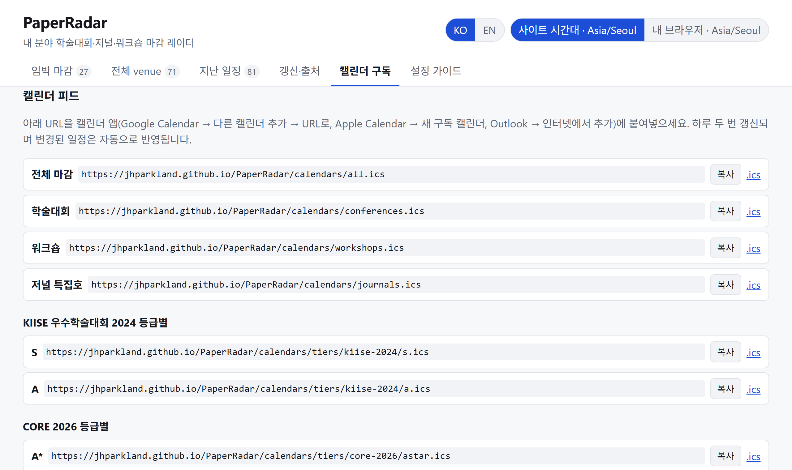
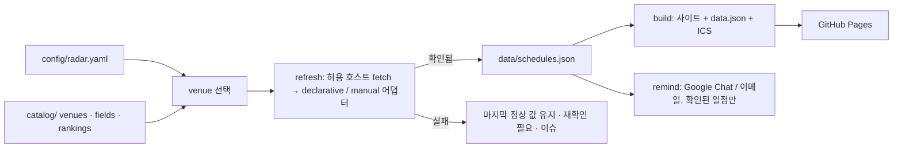

# PaperRadar

**내 연구 분야의 학술대회·저널·워크숍 마감을 한곳에서 보는 레이더.**
포크해서 설정 파일 하나에 분야를 적으면, D-day가 붙은 정적 사이트, 구독 가능한
캘린더, Google Chat / 이메일 리마인더가 생깁니다. GitHub Actions가 매일 공식
CFP를 다시 읽어 갱신하고 GitHub Pages에 배포합니다. 서버도 DB도 없습니다.

### 🔗 <https://jhparkland.github.io/PaperRadar/>

이 저장소가 배포한 예시 사이트입니다. 포크하면 `https://<본인 계정>.github.io/PaperRadar/`가 됩니다.

[English → README.en.md](README.en.md)

[](https://jhparkland.github.io/PaperRadar/)

<sub>임박 마감 — D-day, 공식 시각과 내 시간대, 확인 상태, CFP 링크</sub>

- **설정 파일 하나.** `config/radar.yaml`에서 분야·venue·등급 체계·시간대·언어·알림
  시점을 고릅니다. 나머지는 모두 공유 자산입니다.
- **카탈로그 방식.** `catalog/`에 venue마다 파일 하나와 그 CFP 페이지를 읽는
  선언형 어댑터가 있습니다. 내 분야 학회를 한 번 넣으면 모두가 씁니다.
- **확인된 일정만.** 등록된 공식 페이지에서만 날짜를 읽습니다. 확인에 실패하면
  마지막 정상 값을 유지하고 표시할 뿐, 추정하지 않습니다.
  → [docs/trust-policy.md](docs/trust-policy.md)
- **제자리에서 갱신되는 캘린더.** 전체·유형별·등급별·venue별 RFC 5545 피드.
  변경 시 `SEQUENCE` 증가, 삭제 시 `CANCELLED`.
- **쓰던 곳으로 오는 알림.** Google Chat 웹훅(혼자 있는 스페이스 = 개인 알림)
  그리고/또는 SMTP 이메일. 새로 등장 · 오늘 마감 · 임박 · 15일 · 30일로 분류해
  하루 한 번.
- **한국어/영어 UI**, 공식 시각 + 내 시간대, 다크 모드, 키보드 접근성,
  사이트 안에 **설정 가이드 탭** 내장.

## 빠른 시작

```bash
git clone https://github.com/<you>/PaperRadar.git
cd PaperRadar
npm ci
cp config/radar.example.yaml config/radar.yaml   # 편집
npm run doctor        # 설정 상태와 빠진 것을 설명
npm run refresh       # 추적 대상 CFP를 모두 읽어 data/schedules.json 갱신
npm run build         # → dist/ (사이트, data.json, calendars/*.ics)
npm run dev           # http://127.0.0.1:4173
```

Node.js 22 이상이 필요합니다.

### 내 분야로 맞추기

```yaml
# config/radar.yaml
select:
  fields: [systems, cloud, sustainable-computing]   # catalog/fields.json 의 id
  venues: [neurips, tpds]                           # catalog/venues/ 의 id
  types: [conference, journal, workshop]
rankings:
  show: [kiise-2024, core-2026, sjr-2025]
  primary: kiise-2024
site:
  timezone: Asia/Seoul
  languages: [ko, en]
  baseUrl: https://<you>.github.io/PaperRadar/
reminders:
  daysBefore: [30, 15, 3, 0]
  channels: [google-chat]
```

[](https://jhparkland.github.io/PaperRadar/#venues)

<sub>전체 venue — 유형·분야·등급으로 거르고, 추적 중이 아닌 venue와 그 이유까지 표시</sub>

### 카탈로그는 예시입니다 — 내 분야로 채워 넣으세요

`catalog/`에 들어 있는 venue 71개는 **작성자 분야(시스템·클라우드·탄소 인식
컴퓨팅)로 만들어 둔 예시**입니다. 모든 분야를 아우르는 목록이 아니고, 그대로
쓰라고 넣은 것도 아닙니다. 포크했다면 **자기 분야 venue로 새로 채우세요.**
남겨둘 것은 구조(스키마와 어댑터 방식)뿐이고, 필요 없는 항목은 지우거나
`select`에서 빼면 됩니다.

가장 빠른 방법은 **LLM 코딩 에이전트(Claude Code, Codex, Cursor 등)에게 맡기는
것**입니다. venue 하나가 문서화된 JSON 파일 하나라서 에이전트가 다루기 좋고,
저장소 루트의 [AGENTS.md](AGENTS.md)에 지켜야 할 규칙이 적혀 있습니다. 저장소를
열고 이렇게 요청하세요:

```text
내 연구 분야는 <분야>야. catalog/venues/ 의 기존 항목은 다른 분야의 예시이니
내 분야에 맞게 새로 채워줘.
- 내가 투고할 만한 학술대회·저널·워크숍을 조사해서 catalog/venues/ 에 추가하고,
  내 분야와 무관한 기존 파일은 지워줘. catalog/fields.json 도 내 분야에 맞게 고쳐.
- 각 venue 의 공식 CFP 페이지를 찾아 declarative 어댑터를 작성하고
  `npm run probe -- --venue <id>` 로 실제 추출 결과를 보여줘.
- 자동 파싱이 안 되면 manual 어댑터로 넣되 verifiedAt 에 오늘 날짜를 적어.
- 날짜·등급을 절대 지어내지 말고, 근거 URL 이 없는 값은 비워둬.
- 내 분야의 등급 체계가 있으면 catalog/rankings/ 에 출처 URL 과 함께 추가해줘.
- 마지막에 config/radar.yaml 의 select 를 맞추고 npm run validate 와 npm test 를
  통과시켜.
```

에이전트가 끝내면 사람이 두 가지만 확인하면 됩니다:

1. `npm run probe -- --venue <id>` 출력의 날짜가 공식 페이지와 같은가
2. `npm run doctor`의 추적 목록이 원하는 대로 나오는가

LLM은 그럴듯한 날짜를 잘 만들어냅니다. PaperRadar의 검증(스키마, 연도 타당성,
마감 순서, `verifiedAt` 필수)이 상당 부분 걸러주지만 **최종 대조는 사람 몫**입니다.
직접 넣고 싶다면 `npm run new-venue` + `npm run probe` →
[docs/adding-a-venue.md](docs/adding-a-venue.md).

### 포크한 뒤 반드시 바꿀 것

**시크릿과 변수는 포크에 따라오지 않습니다.** 알림은 각자 자기 채널을 연결해야
동작합니다.

| 항목 | 어디서 | 왜 |
|---|---|---|
| `site.baseUrl` | `config/radar.yaml` | 내 Pages 주소로. 안 바꾸면 알림 링크가 원저자 사이트로 갑니다 (`npm run doctor`가 잡아줍니다) |
| `site.title` · `tagline` · `timezone` · `languages` | `config/radar.yaml` | 내 기준으로 |
| `select.fields` · `select.venues` | `config/radar.yaml` | 내 분야로 |
| `reminders.language` · `daysBefore` | `config/radar.yaml` | 내 취향으로 |
| `GOOGLE_CHAT_WEBHOOK_URL` 또는 SMTP 시크릿 | GitHub *Settings → Secrets and variables → Actions* | **개인 채널.** 포크에 복사되지 않습니다 |

- **웹훅 URL은 비밀번호와 같습니다.** 그 URL을 아는 사람은 누구나 내 스페이스에
  글을 쓸 수 있습니다. 저장소에 커밋하거나 이슈·PR에 붙여넣지 말고 반드시
  시크릿에 두세요.
- 로컬 실행용은 `.env`(`.gitignore` 대상)에 넣습니다: `cp .env.example .env`
- **알림을 설정하지 않아도 나머지는 전부 동작합니다** — 사이트, 캘린더 구독,
  매일 갱신은 시크릿 없이 그대로입니다. 알림만 조용할 뿐입니다.

### 배포

1. 저장소 *Settings → Pages → Source: GitHub Actions*.
2. `main`에 push. *Deploy Pages* 워크플로가 `dist/`를 빌드해 배포합니다.
3. *Settings → Secrets → Actions*에 `GOOGLE_CHAT_WEBHOOK_URL`
   ([설정 방법](docs/setup-google-chat.md)) 그리고/또는 SMTP 시크릿 추가.
   시크릿 이름을 다르게 쓰고 싶으면 이름은 그대로 두고, 저장소 **변수**
   `GOOGLE_CHAT_SECRET_NAME`에 그 이름을 적으면 됩니다 (예: `NOTI`).
   변수에는 이름만 들어가고 URL은 들어가지 않습니다.
4. *Actions → Daily refresh → Run workflow*에서 **test_notification**을 체크해
   채널이 동작하는지 확인.

이후 `refresh.yml`이 매일(기본 02:17 KST) 실행됩니다: 갱신 → 테스트 → 검증 →
빌드 → 알림 → `data/` 커밋 → 배포. 출처 확인에 실패한 venue는
`source-failure` 라벨 이슈 하나에 누적되고, 사이트는 마지막 확인 값을 유지합니다.

## 알림은 언제, 어떻게 오나

| 무엇 | 언제 | 어디로 |
|---|---|---|
| **마감 다이제스트** | 하루 한 번, 아래 분류로 묶어서 | Google Chat 스페이스 / 이메일 |
| **출처 확인 실패** | 공식 페이지를 못 읽거나 문구가 바뀌어 재확인이 필요할 때 | GitHub 이슈 (하나에 누적, 복구되면 자동 닫힘) |
| **전체 변경 기록** | 매일 갱신 때마다 | 사이트 *갱신·출처* 탭, `data/updates.json` |

### 분류

| 분류 | 뜻 |
|---|---|
| 🆕 새로 등장 | TBA였던 일정에 날짜가 잡혔거나 새 마감이 생김 |
| 🔴 오늘 마감 | 오늘이 마감일 (`daysBefore`의 `0`) |
| 🟠 마감 임박 | `imminentDays`(기본 3일) 이하 |
| 🟡 N일 남음 | `daysBefore`의 나머지 시점마다 한 섹션 (기본 15일, 30일) |
| 📅 새 회차 추적 시작 | 회차가 끝나 다음 해 CFP로 자동 전환됨 |
| 🔁 일정 변경 · ❌ 삭제 · ✅ 재확인 | 갱신에서 감지된 변경 (`notifyChanges`, 기본 켜짐) |

```text
📡 PaperRadar · 마감 알림
5건의 마감이 다가옵니다

🆕 새로 등장 (1)
  HotOS 2027 · 논문 마감
    2027-01-15 23:59 AoE
    현지(Asia/Seoul): 2027-01-16 20:59

🔴 오늘 마감 (1)
  D-Day · ASPLOS 2027 · 9월 사이클 논문 마감
    공식: 2026-09-09 23:59 AoE
    현지(Asia/Seoul): 2026-09-10 20:59

🟠 마감 임박 (1)
  D-2 · NSDI 2027 · 가을 초록 마감
    …

🟡 15일 남음 (1)
🟡 30일 남음 (1)

확인된(Verified) 일정만 알립니다. 전체 일정: https://<you>.github.io/PaperRadar/
```

### 규칙

- 그날 해당되는 것 전부가 **메시지 하나**에 들어갑니다. 마감과 일정 변경이 따로
  오지 않습니다.
- "새로 등장"으로 소개된 마감은 같은 메시지의 다른 섹션에 중복해서 싣지 않습니다.
- 저자가 뭔가 해야 하는 항목만 알립니다: 초록·논문·최종본 마감. 결과 통보일과
  행사일은 캘린더에는 들어가지만 알림은 오지 않습니다.
- 각 시점은 마감당 한 번만. 발송 기록이 `data/state/reminders.json`에 남아 다시
  실행해도 중복되지 않습니다. Actions가 하루 건너뛰면 다음 날 밀린 알림이 나갑니다.
- 새 마감이 갑자기 10일 앞으로 등록되면 30·15를 다 보내지 않고 **15일 섹션에 한 번**만
  실립니다.
- 시간대가 공식 페이지에 없는 마감(`unspecified`)은 사이트에 표시만 하고 알리지
  않습니다. 추정으로 사람을 깨우지 않기 위해서입니다.
- 처음 켠 날은 변경 감지의 기준점만 기록하고 "새로 등장"을 보내지 않습니다(이미
  있던 마감 120건을 쏟아내지 않기 위해).
- 출처 확인 실패는 GitHub 이슈로 가므로 기본 제외. `reminders.notifyFailures: true`로
  메시지에도 포함할 수 있습니다.

언제든 형식을 미리 보려면:

```bash
npm run remind -- --sample 5
```

GitHub에서는 *Actions → Daily refresh → Run workflow → **sample_notification*** 체크로
실행됩니다. 발송 기록은 건드리지 않습니다.

알림이 안 오면: ① `GOOGLE_CHAT_WEBHOOK_URL` 시크릿(또는 `GOOGLE_CHAT_SECRET_NAME`
변수)이 있는지 ② `radar.yaml`의 `reminders.channels`에 `google-chat`이 있는지
③ Actions 로그의 *Send due reminders* 단계에 `nothing to send today`가 찍혔는지
순서로 보세요. 상세는 [docs/setup-google-chat.md](docs/setup-google-chat.md).

## 캘린더 구독

[](https://jhparkland.github.io/PaperRadar/#calendars)

전체·유형별·등급별·venue별 피드를 캘린더 앱에 URL로 붙여넣으면 됩니다. 하루 두 번
갱신되고, 날짜가 바뀌면 `SEQUENCE`가 올라가 기존 일정이 제자리에서 수정됩니다.
사라진 일정은 `CANCELLED`로 전달됩니다.

## 연도가 바뀌면

venue 파일은 회차 하나를 추적합니다. 그 회차의 마감이 모두 지나면 **다음 해 CFP를
스스로 찾아 넘어갑니다** — 학회가 연도만 다른 URL에 회차를 올리는 경우에 한해서.

```json
"rollover": {
  "url": "https://{year}.eurosys.org/cfp.html",
  "allowedHosts": ["{year}.eurosys.org"],
  "maxAhead": 2
}
```

카탈로그의 CFP 추적 venue 26개 중 **20개**에 이 블록이 들어 있습니다. 넘어갈 때는
venue 파일의 `url`·`edition`이 다시 쓰이고 커밋되므로, git diff로 확인할 수 있습니다.
옛 회차는 `data/schedules.json`에 이력으로 남고, 알림에 **📅 새 회차 추적 시작**으로
뜹니다.

받아들이는 조건은 깐깐합니다 — 페이지가 이 venue의 패턴으로 파싱되고, **미래**
마감이 하나 이상 있고, 모든 날짜가 이전 회차보다 오래되지 않아야 합니다. 마지막
조건이 **작년 내용을 복사해둔 껍데기 페이지**를 걸러냅니다(실제로 SIGCOMM 2027
페이지가 여기서 거부됩니다). 조건을 못 채우면 조용히 넘어가고 다음 날 다시 시도합니다.

회차마다 호스트가 완전히 바뀌는 학회(`hpdc.sci.utah.edu/2026/` → 다른 도메인)는
자동으로 못 넘어갑니다. 그런 경우는 사람이 venue 파일을 고쳐야 하고, 옛 페이지가
사라지면 `source-failure` 이슈로 알려줍니다. 절차는
[docs/adding-a-venue.md](docs/adding-a-venue.md).

## 동작 구조



| 경로 | 내용 |
|---|---|
| `config/radar.yaml` | 내 선택 (편집하는 유일한 파일) |
| `catalog/fields.json` | 분야 분류 |
| `catalog/rankings/*.json` | venue id 기준 등급 체계 (KIISE 2024, CORE 2026, SJR 분위 …) |
| `catalog/venues/*.json` | venue 파일: 정체성 + CFP 어댑터 |
| `data/schedules.json` | 수집된 마감 + 상태 + 출처 |
| `data/updates.json` | 변경 로그 |
| `data/state/` | 캘린더 SEQUENCE, 발송된 알림 |
| `site/` | 정적 프런트엔드 |
| `scripts/` | `doctor`, `validate`, `refresh`, `build`, `remind`, `probe`, `new-venue`, `serve` |

전체 옵션: [docs/config-reference.md](docs/config-reference.md).

## 명령어

| 명령어 | 역할 |
|---|---|
| `npm run doctor` | 설정 점검과 안내 |
| `npm run validate` | 설정·카탈로그·데이터 검증 (CI 게이트) |
| `npm run refresh` | 공식 CFP에서 `data/` 갱신 (`--only`, `--dry-run`, `--report`) |
| `npm run build` / `npm run dev` | `dist/` 빌드 / 로컬 제공 |
| `npm run remind` | 알림 발송 (`--test`, `--sample [n]`, `--dry-run`, `--channel`) |
| `npm run probe` | CFP 페이지 분석, venue 어댑터 실행 |
| `npm run new-venue` | 카탈로그 파일 스캐폴드 |
| `npm test` | 단위 테스트 |

## 카탈로그 범위

초기 카탈로그는 시스템·구조·HPC·클라우드·네트워킹·성능·지속가능(탄소 인식)
컴퓨팅·ML/ML 시스템·에너지 저널을 다룹니다. 등급: KIISE 2024(BK21 참고),
CORE 2026, SJR 분위.

## 기여하기

이 저장소는 한 사람의 도구가 아니라 **분야별 카탈로그를 같이 키우는 곳**입니다.

| 상황 | 방법 |
|---|---|
| 날짜가 틀렸다, 사이트가 깨졌다, 명령이 실패한다 | [Issue](../../issues) — 어떤 venue인지, 공식 페이지 URL, 재현 명령을 적어주세요 |
| 내 분야 venue를 추가했다 / 어댑터를 고쳤다 | **Pull Request** — `catalog/venues/<id>.json`(+ 필요하면 `rankings/`)만 바꾸면 됩니다 |
| 다른 등급 체계(CCF, 분야별 목록 등)를 넣고 싶다 | PR로 `catalog/rankings/<scheme>.json` 추가, 출처 URL 필수 |
| 코드 버그·기능 개선 | PR — 동작 변경에는 `test/` 아래 테스트를 같이 넣어주세요 |

PR을 올리면 CI가 `npm test → validate → build`를 자동으로 돌려 스키마 오류,
깨진 정규식, 잘못된 날짜 형식을 잡아줍니다. 체크리스트와 규칙(공식 출처만,
지어내지 않기, `verifiedAt`)은 [CONTRIBUTING.md](CONTRIBUTING.md)에 있습니다.
카탈로그 파일을 LLM으로 만들었다면 PR 설명에 그렇게 적고 `probe` 결과를
붙여주세요 — 리뷰가 훨씬 빨라집니다.

## 라이선스

MIT
