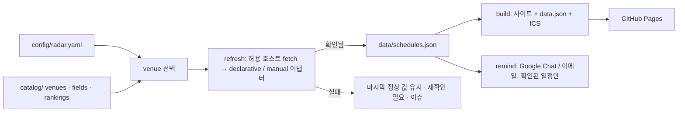

# PaperRadar

**내 연구 분야의 학술대회·저널·워크숍 마감을 한곳에서 보는 레이더.**
포크해서 설정 파일 하나에 분야를 적으면, D-day가 붙은 정적 사이트, 구독 가능한
캘린더, Google Chat / 이메일 리마인더가 생깁니다. GitHub Actions가 매일 공식
CFP를 다시 읽어 갱신하고 GitHub Pages에 배포합니다. 서버도 DB도 없습니다.

[English → README.en.md](README.en.md)

- **설정 파일 하나.** `config/radar.yaml`에서 분야·venue·등급 체계·시간대·언어·알림
  시점을 고릅니다. 나머지는 모두 공유 자산입니다.
- **카탈로그 방식.** `catalog/`에 venue마다 파일 하나와 그 CFP 페이지를 읽는
  선언형 어댑터가 있습니다. 내 분야 학회를 한 번 넣으면 모두가 씁니다.
- **확인된 일정만.** 등록된 공식 페이지에서만 날짜를 읽습니다. 확인에 실패하면
  마지막 정상 값을 유지하고 표시할 뿐, 추정하지 않습니다.
  → [docs/trust-policy.md](docs/trust-policy.md)
- **제자리에서 갱신되는 캘린더.** 전체·유형별·등급별·venue별 RFC 5545 피드.
  변경 시 `SEQUENCE` 증가, 삭제 시 `CANCELLED`.
- **쓰던 곳으로 오는 알림.** Google Chat 웹훅(혼자 있는 스페이스 = 개인 알림)
  그리고/또는 SMTP 이메일. 60/30/15/3일 전.
- **한국어/영어 UI**, 공식 시각 + 내 시간대, 다크 모드, 키보드 접근성,
  사이트 안에 **설정 가이드 탭** 내장.

## 빠른 시작

```bash
git clone https://github.com/<you>/PaperRadar.git
cd PaperRadar
npm ci
cp config/radar.example.yaml config/radar.yaml   # 편집
npm run doctor        # 설정 상태와 빠진 것을 설명
npm run refresh       # 추적 대상 CFP를 모두 읽어 data/schedules.json 갱신
npm run build         # → dist/ (사이트, data.json, calendars/*.ics)
npm run dev           # http://127.0.0.1:4173
```

Node.js 22 이상이 필요합니다.

### 내 분야로 맞추기

```yaml
# config/radar.yaml
select:
  fields: [systems, cloud, sustainable-computing]   # catalog/fields.json 의 id
  venues: [neurips, tpds]                           # catalog/venues/ 의 id
  types: [conference, journal, workshop]
rankings:
  show: [kiise-2024, core-2026, sjr-2025]
  primary: kiise-2024
site:
  timezone: Asia/Seoul
  languages: [ko, en]
  baseUrl: https://<you>.github.io/PaperRadar/
reminders:
  daysBefore: [60, 30, 15, 3]
  channels: [google-chat]
```

카탈로그에 없는 학회는 `npm run new-venue`로 파일을 만들고 `npm run probe`로
CFP 페이지의 날짜 위치를 확인해 패턴을 채웁니다 →
[docs/adding-a-venue.md](docs/adding-a-venue.md). 자동 파싱이 안 되는 페이지는
`manual` 어댑터에 날짜와 확인일을 직접 적습니다.

### 내 분야 venue 채우기 — LLM에게 맡기기

카탈로그는 venue당 JSON 파일 하나에 스키마가 문서화되어 있어서, 정규식을 손으로
짜는 대신 **LLM 코딩 에이전트(Claude Code, Codex, Cursor 등)에게 시키는 것**이
가장 빠릅니다. 저장소 루트의 [AGENTS.md](AGENTS.md)에 에이전트가 지켜야 할 규칙이
있으니, 저장소를 열고 이렇게 요청하면 됩니다:

```text
내 연구 분야는 <분야>야. 이 분야에서 투고할 만한 학술대회·저널·워크숍을
catalog/venues/ 에 추가하고 config/radar.yaml 의 select 를 맞춰줘.
- 각 venue 의 공식 CFP 페이지를 찾아 declarative 어댑터를 작성하고
  `npm run probe -- --venue <id>` 로 실제 추출 결과를 확인해서 보여줘.
- 자동 파싱이 안 되면 manual 어댑터로 넣되 verifiedAt 에 오늘 날짜를 적어.
- 날짜·등급을 절대 지어내지 말고, 근거 URL 이 없는 값은 비워둬.
- 마지막에 npm run validate 와 npm test 를 통과시켜.
```

에이전트가 끝내면 다음 두 가지만 사람이 확인하면 됩니다:

1. `npm run probe -- --venue <id>` 출력의 날짜가 공식 페이지와 같은가
2. `npm run doctor`에서 추적 목록이 원하는 대로 나오는가

LLM은 그럴듯한 날짜를 만들어내기 쉽습니다. PaperRadar의 검증(`validate`, 연도
타당성, 마감 순서, `verifiedAt` 필수)이 상당 부분 걸러주지만, 최종 대조는 사람이
합니다.

### 배포

1. 저장소 *Settings → Pages → Source: GitHub Actions*.
2. `main`에 push. *Deploy Pages* 워크플로가 `dist/`를 빌드해 배포합니다.
3. *Settings → Secrets → Actions*에 `GOOGLE_CHAT_WEBHOOK_URL`
   ([설정 방법](docs/setup-google-chat.md)) 그리고/또는 SMTP 시크릿 추가.
4. *Actions → Daily refresh → Run workflow*에서 **test_notification**을 체크해
   채널이 동작하는지 확인.

이후 `refresh.yml`이 매일(기본 02:17 KST) 실행됩니다: 갱신 → 테스트 → 검증 →
빌드 → 알림 → `data/` 커밋 → 배포. 출처 확인에 실패한 venue는
`source-failure` 라벨 이슈 하나에 누적되고, 사이트는 마지막 확인 값을 유지합니다.

## 알림은 언제, 어떻게 오나

| 무엇 | 언제 | 어디로 |
|---|---|---|
| **마감 리마인더** | 확인된(Verified) 마감의 `daysBefore` 시점마다 한 번씩. 기본 60·30·15·3일 전 | Google Chat 스페이스 / 이메일 |
| **출처 확인 실패** | 공식 페이지를 못 읽거나 문구가 바뀌어 재확인이 필요할 때 | GitHub 이슈 (하나에 누적, 복구되면 자동 닫힘) |
| **일정 변경 다이제스트** | 날짜가 확정(TBA → 날짜)·변경·삭제되거나 출처가 다시 확인됐을 때, 그날 한 번 | Google Chat / 이메일 (`reminders.notifyChanges`, 기본 켜짐) + 사이트 *갱신·출처* 탭 |

마감 리마인더의 규칙:

- 매일 한 번 실행되며, 그날 해당되는 마감을 **메시지 하나로 묶어** 보냅니다.
- 저자가 뭔가 해야 하는 항목만 알립니다: 초록·논문·최종본 마감. 결과 통보일과
  행사일은 캘린더에는 들어가지만 알림은 오지 않습니다.
- 각 시점은 마감당 한 번만. 발송 기록이 `data/state/reminders.json`에 남아 다시
  실행해도 중복되지 않습니다. Actions가 하루 건너뛰면 다음 날 밀린 알림이 나갑니다.
- 새 마감이 갑자기 10일 앞으로 등록되면 60/30/15를 다 보내지 않고 **D-10 한 건**만
  보냅니다.
- 시간대가 공식 페이지에 없는 마감(`unspecified`)은 사이트에 표시만 하고 알리지
  않습니다. 추정으로 사람을 깨우지 않기 위해서입니다.

받는 메시지 예:

```text
📡 PaperRadar · 마감 알림
2건의 마감이 다가옵니다

D-30 · EuroSys 2027 · 가을 논문 마감
  공식: 2026-09-24 23:59 AoE
  현지(Asia/Seoul): 2026-09-25 20:59
  [CFP 열기]

D-15 · IPDPS 2027 · 초록 마감
  …
확인된(Verified) 일정만 알립니다. 전체 일정: https://<you>.github.io/PaperRadar/
```

일정 변경 다이제스트는 이렇게 옵니다:

```text
📡 PaperRadar · 일정 변경
2건이 바뀌었습니다

🆕 확정 (TBA → 날짜) · HotOS 2027 · 논문 마감
  TBA → 2027-01-15 23:59 AoE
  현지(Asia/Seoul): 2027-01-16 20:59
🔁 변경 · EuroSys 2027 · 가을 논문 마감
  2026-09-24 23:59 AoE → 2026-10-01 23:59 AoE
  …
```

- 처음 켠 날은 기준점만 기록하고 보내지 않습니다(이미 있던 마감 120건을 "확정"으로
  쏟아내지 않기 위해). 그 다음 갱신부터 감지된 변경만 옵니다.
- 출처 확인 실패는 GitHub 이슈로 가므로 기본 제외. `reminders.notifyFailures: true`로
  포함할 수 있습니다.
- 끄려면 `reminders.notifyChanges: false`.

알림이 안 오면: ① `GOOGLE_CHAT_WEBHOOK_URL` 시크릿이 있는지 ② `radar.yaml`의
`reminders.channels`에 `google-chat`이 있는지 ③ Actions 로그의 *Send due reminders*
단계에 `nothing due today` / `changes: nothing new`가 찍혔는지 순서로 보세요. 상세는
[docs/setup-google-chat.md](docs/setup-google-chat.md).

## 동작 구조



| 경로 | 내용 |
|---|---|
| `config/radar.yaml` | 내 선택 (편집하는 유일한 파일) |
| `catalog/fields.json` | 분야 분류 |
| `catalog/rankings/*.json` | venue id 기준 등급 체계 (KIISE 2024, CORE 2026, SJR 분위 …) |
| `catalog/venues/*.json` | venue 파일: 정체성 + CFP 어댑터 |
| `data/schedules.json` | 수집된 마감 + 상태 + 출처 |
| `data/updates.json` | 변경 로그 |
| `data/state/` | 캘린더 SEQUENCE, 발송된 알림 |
| `site/` | 정적 프런트엔드 |
| `scripts/` | `doctor`, `validate`, `refresh`, `build`, `remind`, `probe`, `new-venue`, `serve` |

전체 옵션: [docs/config-reference.md](docs/config-reference.md).

## 명령어

| 명령어 | 역할 |
|---|---|
| `npm run doctor` | 설정 점검과 안내 |
| `npm run validate` | 설정·카탈로그·데이터 검증 (CI 게이트) |
| `npm run refresh` | 공식 CFP에서 `data/` 갱신 (`--only`, `--dry-run`, `--report`) |
| `npm run build` / `npm run dev` | `dist/` 빌드 / 로컬 제공 |
| `npm run remind` | 알림 발송 (`--test`, `--dry-run`, `--channel`) |
| `npm run probe` | CFP 페이지 분석, venue 어댑터 실행 |
| `npm run new-venue` | 카탈로그 파일 스캐폴드 |
| `npm test` | 단위 테스트 |

## 카탈로그 범위

초기 카탈로그는 시스템·구조·HPC·클라우드·네트워킹·성능·지속가능(탄소 인식)
컴퓨팅·ML/ML 시스템·에너지 저널을 다룹니다. 등급: KIISE 2024(BK21 참고),
CORE 2026, SJR 분위.

## 기여하기

이 저장소는 한 사람의 도구가 아니라 **분야별 카탈로그를 같이 키우는 곳**입니다.

| 상황 | 방법 |
|---|---|
| 날짜가 틀렸다, 사이트가 깨졌다, 명령이 실패한다 | [Issue](../../issues) — 어떤 venue인지, 공식 페이지 URL, 재현 명령을 적어주세요 |
| 내 분야 venue를 추가했다 / 어댑터를 고쳤다 | **Pull Request** — `catalog/venues/<id>.json`(+ 필요하면 `rankings/`)만 바꾸면 됩니다 |
| 다른 등급 체계(CCF, 분야별 목록 등)를 넣고 싶다 | PR로 `catalog/rankings/<scheme>.json` 추가, 출처 URL 필수 |
| 코드 버그·기능 개선 | PR — 동작 변경에는 `test/` 아래 테스트를 같이 넣어주세요 |

PR을 올리면 CI가 `npm test → validate → build`를 자동으로 돌려 스키마 오류,
깨진 정규식, 잘못된 날짜 형식을 잡아줍니다. 체크리스트와 규칙(공식 출처만,
지어내지 않기, `verifiedAt`)은 [CONTRIBUTING.md](CONTRIBUTING.md)에 있습니다.
카탈로그 파일을 LLM으로 만들었다면 PR 설명에 그렇게 적고 `probe` 결과를
붙여주세요 — 리뷰가 훨씬 빨라집니다.

## 라이선스

MIT
